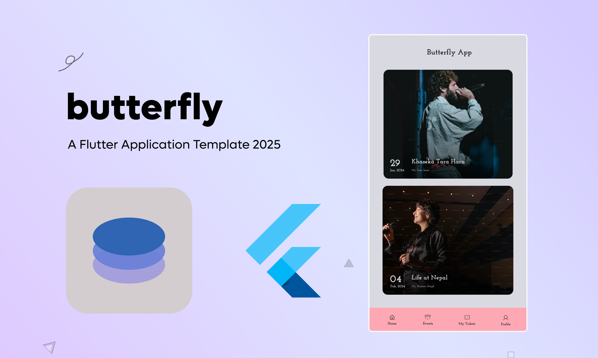

# 🚀 Butterfly App - Flutter 2025 Project Template

A scalable, production-ready Flutter project boilerplate for 2025 — featuring modern architecture and offline-first capabilities. Built with **BLoC**, **Feature-Based Modularity**, and **Repository Pattern**, this template is designed to help you kickstart your next app efficiently and cleanly.

---




## 🧱 Project Structure

```bash
lib/
├── core/                   # Core utilities, constants, error handling
│   ├── network/            # Network client, interceptors, API base
│   ├── di/                 # Dependency injection setup (GetIt + Injectable)
│   └── di_module/           # Shared Preferences, Connectivity, Logger, etc.
├── data/                  
│   ├── local/              # Hive DB manager, shared_pref helper
│   ├── remote/             # API services
│   └── repositories/       # Implementation of repository interfaces
├── domain/                
│   ├── entities/           # Models/entities
│   └── repositories/       # Abstract repository contracts
├── features/              # Feature-based folders
│   ├── auth/               # Login, signup flows
│   ├── home/               # Home page with bottom navigation
│   └── ...                 # Additional modules
└── main.dart             # App entry point
```

---

## 🚀 Key Features

- ✅ **Feature-Based Architecture** for better scalability and modular development
- ✅ **BLoC (flutter_bloc)** for state management
- ✅ **Hive** for offline local storage (via a separate database manager)
- ✅ **Shared Preferences** for storing small flags (e.g., first-time login)
- ✅ **GetIt + Injectable** for dependency injection
- ✅ **Repository Pattern** with Network Bound Resource to manage data flow
- ✅ **Offline-First Architecture**
- ✅ **Login Flow -> Bottom Navigation** with persistent session
- ✅ **Support for clean and testable code**

---

## 📆 Roadmap

- [x] Launcher Icons & Splash Screen
- [x] UI Improvements
- [ ] CI/CD Integration
- [x] Dark Mode & Theme Support
- [ ] Localization
- [ ] Unit and Widget Tests

---

## ✍️ Contributing

Feel free to fork and contribute to this template. PRs are welcome!

---


Crafted with ❤️ 

